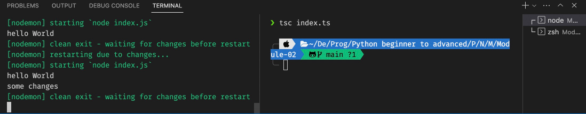

# TypeScript

# Module-02

---

## **2-1: Installation typescript, nvm & ts-node-dev**

Click Here to see: [NVM install command for MacOS](https://dev.to/httpjunkie/setup-node-version-manager-nvm-on-mac-m1-7kl?fbclid=IwAR3RL9Qxl5a-ZdzhZIP427DSCvwC3sXVrSdu-wEk-zbwYlSDO3Mosoaxzzk)

### TypeScript Install and run

TS File can’t run by default so, we need to compile first `.ts` file to a `.js` file and then run that `.js` file to see the output. for converting the `.ts` file into the `.js` file we need to install TypeScript Compiler in short TSC.

For installing TypeScript Compiler:

```bash
npm install -g typescript
tsc --v
```

then we need to compile the following command: 

```bash
tsc index.ts
```

then we can run that `.js` file using this command: 

```bash
node index.js
```

### Overcome this lengthy process:

at first, we need to create a node application that includes the `node_module` folder. also need to install `nodemon` for automatically re-rendering the node server if anything changes.

```bash
npm init -y

# Install nodemon globally on your machine
npm install -g nodemon
```

then need to config the `package.json` file. add inside `“scripts”` section:

```json
"scripts": {
		"start": "nodemon index.js",
ts-node-dev --respawn --transpile-only server.ts
    "test": "echo \"Error: no test specified\" && exit 1"
  },
```

now, we can use `npm start` command to see the output of the javascript file. don’t need to use `node index.js` command every time.

but still, we have a problem because if any change happens in the `.ts` file then need to compile it to the `.js` file. always we need to open two terminals:



1. for `npm start` or,  `nodemon index.js` command.
2. compile typescript file into javascript file using `tsc index.js` command.

 To fix this issue try **Typescript Node Dev**.

### Final & Most Easy Way: to run `.ts` file

> TypeScript Node Dev Install Command:
> 
> 
> ```bash
> npm i ts-node-dev --save-dev
> ```
> 
> after install need to config the `package.json` file. add inside `“scripts”` section and no longer need to use `nodemon`.
> 
> ```json
> "scripts": {
> 		"start": "ts-node-dev --respawn --transpile-only index.ts",
>     "test": "echo \"Error: no test specified\" && exit 1"
>   },
> ```
> 
> ```bash
> tsc --init
> ```
> 
> it is used to compile `.ts` files to the `.js` file automatically by running this command. 
> 
> ```bash
> npm start
> ```
> 
> using the above command we can run `index.ts` file very easily and when any changes happen it automatically run that code and show the output. 
> 
> now, if we want to separate all `.ts` and `.js` files into a separate folder.
> 
> for example, we want to put all of `.ts` files into the `scr` folder, and after compiling all `.js` files automatically generate into the `dist` folder. so, we need to configure `tsconfig.json` file.
> 
> ```json
> /* search rootDir then, uncomment that and write the scr folder path.*/
> "rootDir": "./src",
> /* search outDir then, uncomment that and write the dist folder path.*/
> "outDir": "./dist",
> ```
> 
> if you getting error 
> 
> 'rootDir' is expected to contain all source files.
> The file is in the program because:
> Matched by default include pattern '**/*'
> 
> Found 1 error.
> 
> use this:
> 
> ```json
> /* search rootDir then, uncomment that and write the scr folder path.*/
> "rootDir": "src",
> /* search outDir then, uncomment that and write the dist folder path.*/
> "outDir": "./dist",
> ```
> 
> now use just one command to compile all `.ts` files to `.js` files using `tsc` command.
> 
> ```bash
> tsc
> ```
> 
> see the output automatically `npm start` but it's not working because we don't have `index.ts` file in the root dir. 
> 
> we can run the command `nodemon dist/index.js` to watch the changes of the `.js` file and make changes inside of the `index.ts` file then just run the command `tsc`. it automatically shows the output. 
>